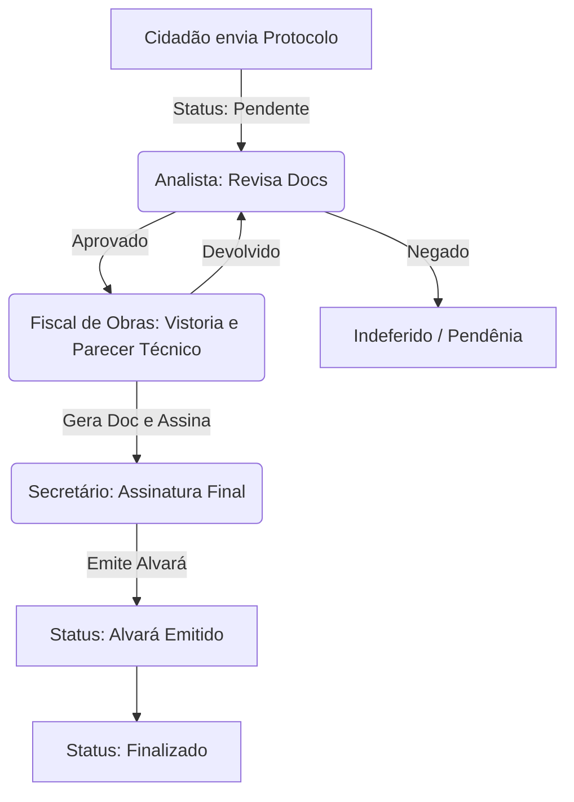

# Plano de Implementação: Novo Fluxo Administrativo (3 Setores)

O objetivo é otimizar o fluxo de trabalho dividindo as responsabilidades em três setores distintos, garantindo que cada usuário tenha acesso focado em sua área de atuação.

## 1. Definição dos Novos Papéis (Níveis de Acesso)

### 1.1 Analista (Primeiro Setor)

- **Função**: Triagem inicial de documentos e verificação de viabilidade.
- **Destaque na Interface**: Tela simplificada de requerimentos filtrados por **"Pendente"** e **"Em análise"**.
- **Ação Crítica**: Botão **"Enviar para Fiscalização de Obras"** (Muda status para **"Aguardando Fiscalização"**).

### 1.2 Fiscal de Obras (Segundo Setor)

- **Função**: Vistoria técnica e elaboração do parecer/alvará preliminar.
- **Destaque na Interface**: Dashboard focado em **"Aguardando Fiscalização"**.
- **Ação Crítica**: Gerar o documento em `gerar_documento.php` e aplicar a **assinatura técnica**.
- **Resultado**: Ao assinar, o sistema move automaticamente para **"Apto a gerar alvará"** (disponível para o Secretário).

### 1.3 Secretário (Terceiro Setor)

- **Função**: Revisão final e assinatura institucional.
- **Destaque na Interface**: Dashboard de aprovação já existente (`secretario_dashboard.php`).
- **Ação Crítica**: Assinatura final e emissão do alvará concluído.

## 2. Progressão de Status (Workflow)

## 3. Alterações Necessárias no Código

### 3.1 Banco de Dados

- Adicionar nível `analista` e `fiscal` na tabela `administradores`.
- Garantir que o campo `status` em `requerimentos` aceite o valor **'Aguardando Fiscalização'**.

### 3.2 Painel Administrativo (`header.php`)

- Criar menus laterais condicionais:
    - Analistas: Menu **"Análise de Protocolos"**.
    - Fiscais: Menu **"Fiscalização de Obras"**.

### 3.3 Dashboards Específicos

- `admin/analista_dashboard.php`: Focar em triagem.
- `admin/fiscalizacao_dashboard.php`: Focar em vistorias agendadas e geração de documentos técnicos.
- `admin/secretario_dashboard.php`: (Manter o atual, refinando filtros).

### 3.4 Processamento de Ações (`visualizar_requerimento.php`)

- Implementar botões de transição rápida:
    - **"Aprovar Análise e Enviar Fiscal"**.
    - **"Assinar e Enviar Secretário"** (Já ocorre na geração do documento).

## 4. Diferenciais de Design (Destaque por Área)

- **Temas de Cor**: Usar cores sutis para diferenciar os setores (ex: Azul para Analista, Verde para Fiscal, Dourado/Escuro para Secretário).
- **Cards de Status**: Exibir um "Stepper" (indicador de passos) no topo da visualização do requerimento para mostrar em qual fase do fluxo o processo se encontra atualmente.

---

_Este plano estabelece as bases técnicas e funcionais para a expansão do sistema SEMA-PHP._
