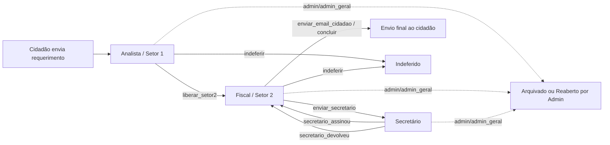

---
tags:
  - obsidian
  - sistema
  - workflow
---

# Visão Geral do Sistema

O SEMA organiza o processamento de requerimentos ambientais e urbanísticos em um fluxo com atores externos e internos.

## Atores formais

- [[Atores/Cidadao|Cidadão]]
- [[Atores/Analista|Analista]]
- [[Atores/Fiscal|Fiscal]]
- [[Atores/Secretario|Secretário]]
- [[Atores/Admin|Admin / Admin Geral]]

## Modelo operacional atual

- `setor1`: triagem e análise inicial do processo.
- `setor2`: análise técnica, geração de documento e preparação para assinatura institucional.
- `secretario`: revisão final e assinatura institucional.
- `concluido`: processo finalizado.

## Estados administrativos relevantes

- `status`: texto mais legível do ponto de vista do processo.
- `status_admin`: estado administrativo canônico como `em_analise`, `deferido`, `indeferido`, `concluido` e `arquivado`.
- `setor_atual`: local do processo dentro do fluxo interno.
- `aguardando_acao`: próximo passo esperado dentro do setor.

## Fluxo macro

## Regras de documentação

- A nomenclatura oficial de papéis é `analista`, `fiscal`, `secretario`, `admin` e `admin_geral`.
- O termo `operador` permanece apenas como legado de compatibilidade em partes do sistema e em documentos antigos.
- Para documentação funcional, `Admin` e `Admin Geral` são tratados como um único ator com privilégios ampliados.

## Navegação sugerida

- Começar em [[Diagramas/Diagrama-Geral-de-Atores]]
- Depois revisar [[Processos/Transicoes-entre-Setores]]
- Em seguida abrir as notas por ator
