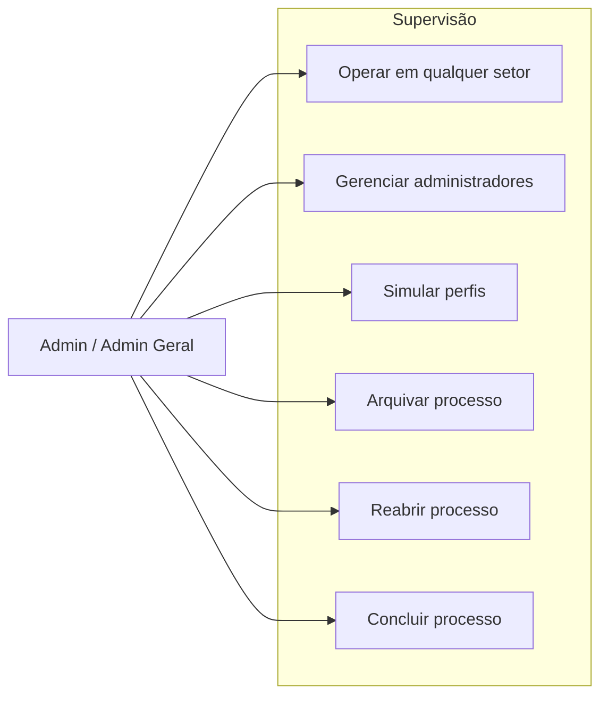

---
tags:
  - obsidian
  - ator
  - admin
---

# Admin / Admin Geral

## Objetivo

Supervisionar o sistema com acesso ampliado, incluindo gestão de usuários, simulação de perfis e override de transições do workflow.

## Entradas principais

- Todo o fluxo administrativo
- Painéis de setores
- Gestão de administradores e recursos do sistema

## Saídas principais

- Processos reabertos, arquivados ou concluídos
- Perfis gerenciados
- Navegação e operação transversal entre setores

## Ações permitidas

- Executar ações do [[Analista]], [[Fiscal]] e [[Secretario]]
- Gerenciar usuários administrativos
- Simular perfis setoriais
- Reabrir processos
- Arquivar processos
- Acompanhar dashboards globais

## Caso de uso

## Observação documental

- `admin` e `admin_geral` são documentados como um ator único.
- Quando necessário, a nota deve explicitar diferenças finas de permissão em nível de interface ou gestão.
