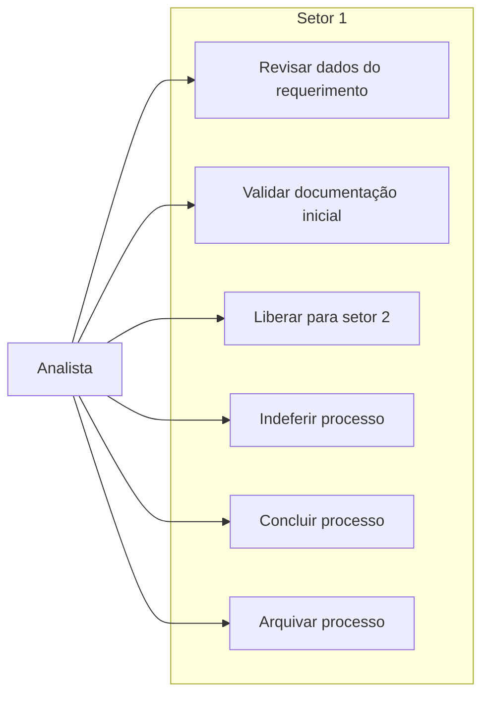

---
tags:
  - obsidian
  - ator
  - analista
---

# Analista

## Objetivo

Executar a triagem inicial do processo no `setor1` e decidir se o requerimento segue para o setor técnico seguinte ou se deve ser encerrado/indeferido.

## Entradas principais

- Requerimentos em `setor_atual = setor1`
- `status_admin = em_analise`
- Dados do requerente, anexos e histórico do processo

## Saídas principais

- Processo liberado para o `setor2`
- Processo indeferido
- Processo concluído ou arquivado quando permitido pelo fluxo

## Ações permitidas

- Visualizar detalhes e anexos do processo
- Marcar o processo como não lido
- Liberar para o setor 2
- Indeferir
- Concluir
- Arquivar

## Caso de uso

## Regras de workflow

- Atua principalmente no `setor1`.
- A transição principal é `liberar_setor2`.
- Seu papel substitui a parte inicial antes atribuída genericamente ao termo legado `operador`.
