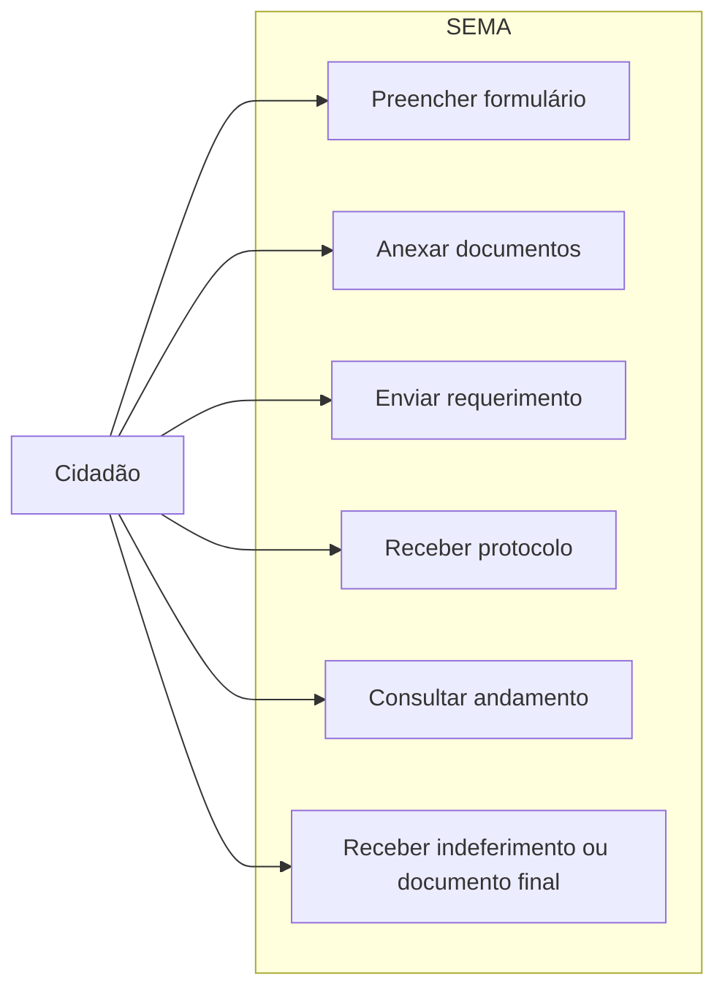

---
tags:
  - obsidian
  - ator
  - cidadao
---

# Cidadão

## Objetivo

Protocolar um requerimento, acompanhar o andamento e receber o documento final ou a comunicação de indeferimento.

## Entradas principais

- Formulário público em `index.php`
- Documentos exigidos por tipo de alvará
- Dados do requerente e, quando aplicável, do proprietário

## Saídas principais

- Número de protocolo
- E-mails automáticos de andamento
- Documento final enviado ao término do fluxo

## Ações permitidas

- Enviar novo requerimento
- Anexar documentos
- Declarar veracidade das informações
- Consultar protocolo
- Receber notificações por e-mail

## Dependências

- Depende da análise do [[Analista]]
- Pode ter comunicação intermediada por [[Fiscal]]
- Recebe o resultado institucional após a etapa do [[Secretario]]

## Caso de uso

## Limites

- Não atua no painel administrativo.
- Não decide transições internas entre setores.
- Não assina documentos internos do fluxo administrativo.
