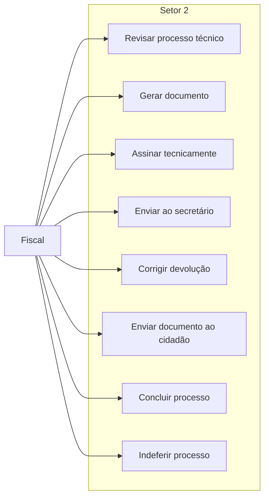

---
tags:
  - obsidian
  - ator
  - fiscal
---

# Fiscal

## Objetivo

Executar a etapa técnica principal no `setor2`, produzir o documento do processo, conduzir a assinatura técnica e preparar ou concluir o envio ao cidadão.

## Entradas principais

- Processos enviados ao `setor2`
- Requerimentos aguardando geração de documento
- Processos devolvidos pelo secretário para correção
- Processos com `status_admin = deferido` aguardando envio ao cidadão

## Saídas principais

- Processo enviado ao secretário
- Processo indeferido
- Processo concluído após envio final

## Ações permitidas

- Revisar documentos do processo
- Gerar documento técnico
- Assinar tecnicamente
- Enviar ao secretário
- Receber devolução para ajuste
- Enviar e-mail final ao cidadão
- Concluir o processo

## Caso de uso

## Regras de workflow

- Atua principalmente no `setor2`.
- Conduz a transição `enviar_secretario`.
- Após a assinatura institucional, o processo retorna ao `setor2` para `envio_cidadao`.
