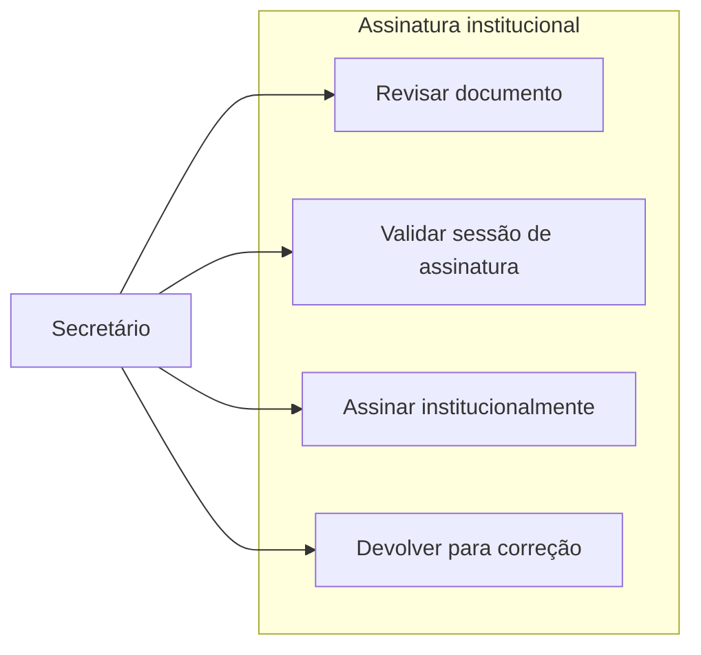

---
tags:
  - obsidian
  - ator
  - secretario
---

# Secretário

## Objetivo

Executar a revisão institucional do documento e decidir entre assinatura final ou devolução para correção.

## Entradas principais

- Processos em `setor_atual = secretario`
- Itens com `aguardando_acao = assinatura_secretario`
- Documento técnico já preparado pelo setor 2

## Saídas principais

- Documento assinado institucionalmente
- Processo devolvido ao setor 2 com motivo

## Ações permitidas

- Revisar conteúdo técnico
- Assinar institucionalmente
- Devolver para correção
- Acompanhar fila de documentos pendentes e emitidos

## Caso de uso

## Regras de workflow

- Atua no `setor_atual = secretario`.
- Se assinar, executa `secretario_assinou` e o processo retorna ao `setor2`.
- Se devolver, executa `secretario_devolveu` com motivo obrigatório.
