---
tags:
  - obsidian
  - diagrama
  - mermaid
---

# Diagrama Geral de Atores

```mermaid
flowchart TB
    cid[Cidadão]
    ana[Analista]
    fis[Fiscal]
    sec[Secretário]
    adm[Admin / Admin Geral]

    subgraph Sistema SEMA
        uc1[Enviar requerimento]
        uc2[Consultar protocolo]
        uc3[Triar documentos]
        uc4[Liberar para setor 2]
        uc5[Gerar documento técnico]
        uc6[Assinar tecnicamente]
        uc7[Enviar ao secretário]
        uc8[Assinar institucionalmente]
        uc9[Devolver para correção]
        uc10[Enviar documento ao cidadão]
        uc11[Indeferir]
        uc12[Arquivar ou reabrir]
    end

    cid --> uc1
    cid --> uc2
    ana --> uc3
    ana --> uc4
    ana --> uc11
    fis --> uc5
    fis --> uc6
    fis --> uc7
    fis --> uc10
    fis --> uc11
    sec --> uc8
    sec --> uc9
    adm --> uc3
    adm --> uc4
    adm --> uc5
    adm --> uc7
    adm --> uc8
    adm --> uc9
    adm --> uc10
    adm --> uc11
    adm --> uc12
```

## Leitura do diagrama

- O cidadão é ator externo do protocolo e da consulta.
- Analista, fiscal e secretário atuam em etapas diferentes do mesmo requerimento.
- Admin/Admin Geral podem atravessar o fluxo com permissões ampliadas.
