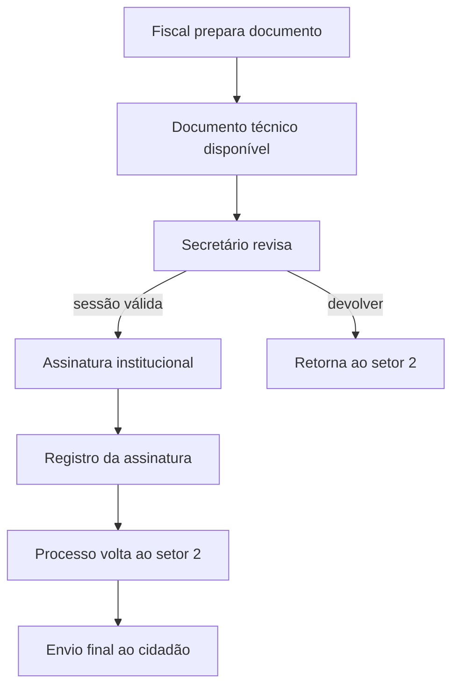

---
tags:
  - obsidian
  - processo
  - assinatura
---

# Fluxo de Assinatura Digital

O sistema possui duas camadas de assinatura dentro do fluxo administrativo: técnica e institucional.

## Etapas principais

- O fiscal produz ou consolida o documento técnico.
- O secretário valida a sessão de assinatura antes da ação final.
- A assinatura institucional não encerra automaticamente o processo; ela devolve o item ao `setor2` para envio final.
