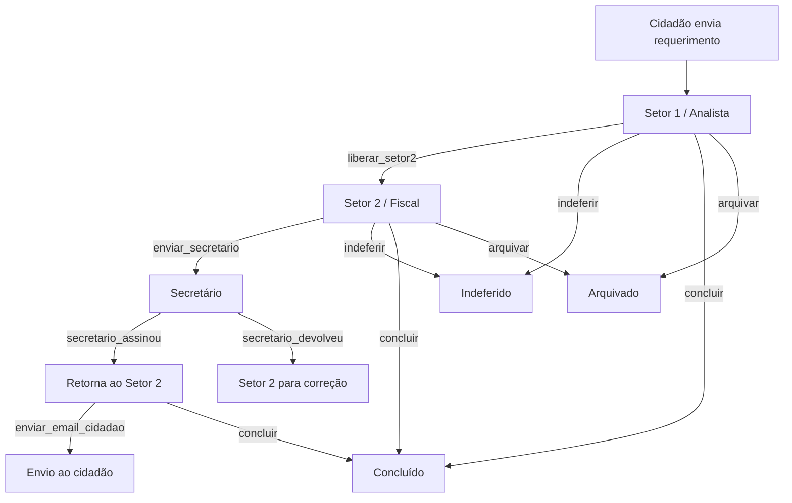

---
tags:
  - obsidian
  - processo
  - requerimentos
---

# Fluxo de Requerimentos

Este é o fluxo principal do sistema, desde o envio público até o encerramento administrativo.

## Leitura operacional

- O cidadão não percorre os setores internos.
- O setor 1 faz triagem e decisão inicial.
- O setor 2 concentra a etapa técnica e o envio final.
- O secretário não encerra o fluxo diretamente; ao assinar, o processo retorna ao setor 2.
