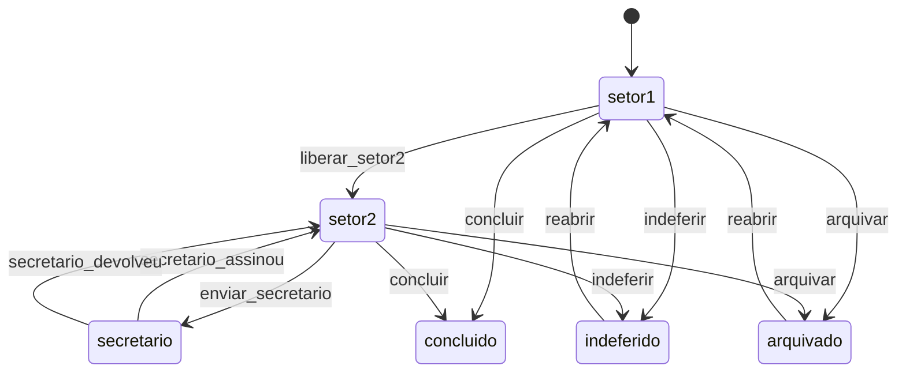

---
tags:
  - obsidian
  - processo
  - workflow
---

# Transições entre Setores

Esta nota resume as transições explicitamente modeladas no workflow do sistema.

## Transições principais

- `liberar_setor2`: move do `setor1` para o `setor2`
- `enviar_secretario`: move do `setor2` para `secretario`
- `secretario_assinou`: move de `secretario` para `setor2`
- `secretario_devolveu`: move de `secretario` para `setor2` com motivo de devolução
- `indeferir`: encerra como `indeferido`
- `concluir`: encerra como `concluido`
- `arquivar`: encerra como `arquivado`
- `reabrir`: retorna ao `setor1`

## Observações

- O secretário atua como etapa de validação, não como etapa terminal do fluxo.
- O envio ao cidadão ocorre depois da volta ao `setor2`.
